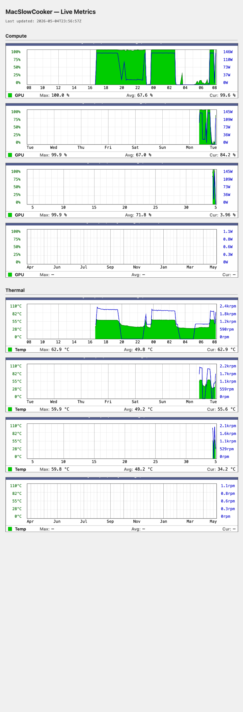

# MacSlowCooker

[](https://github.com/hakaru/MacSlowCooker/actions/workflows/ci.yml)
[](LICENSE)

<p align="center">
  
</p>

A macOS desktop app that visualizes GPU usage, SoC temperature, power, and fan
RPM through a **Dock icon** and a **floating window**, designed for Apple
Silicon and Intel Macs.

It runs `powermetrics` as a root LaunchDaemon and talks to it via XPC, while
also pulling data from `IOAccelerator`, `AppleSMC`, and `IOHIDEventSystem` to
collect a sample every second.

## Features

### Dock icon (cooking-pot metaphor)
- **3D drum-shape pot** rendered with cylindrical shading, dome lid, knob,
  back rim, and chunky loop handles
- Pot color tracks **SoC temperature** (white at 50 °C → red-orange at 95 °C)
- A **layered flame** (red-orange / orange / yellow-white core) under the pot
  scales with GPU usage; a soft halo radiates onto the pot at high load
- **Steam puffs** rising from the lid grow thicker and busier with fan RPM
  (or with temperature on **fanless Macs**)
- **Boiling animation** (lid bounce + warm-tinted steam) triggers after 5 s of
  sustained load or `thermalPressure ≥ Serious`
- Honors **Low Power Mode**: drops to 5 fps and disables flame wiggle while LPM
  is on

### Floating window (Activity Monitor "GPU history" style)
- Titled, movable, resizable `NSWindow` with optional float-above-other-windows
- **Four charts**: GPU / Temperature / Fan / Power with fixed Y-axis ranges
- **Four metric tiles** whose numbers shift **white → yellow → red** with risk
- nil samples render as gaps (no misleading flat-zero baselines)
- Translucent `NSVisualEffectView` background

### History window (MRTG-style)

<p align="center">
  
</p>

- Open with **Cmd+Shift+H** from the menu bar
- Four stacked panels per category — **Daily / Weekly / Monthly / Yearly**
  (24 h / 7 d / 31 d / 400 d retention)
- Two categories selectable via the segmented Picker:
  - **Compute** — GPU% (filled green) + Power W (blue line), dual Y axis
  - **Thermal** — SoC °C (filled green) + Fan RPM (blue line), dual Y axis
- Authentic MRTG aesthetic: white plot background, dense fine + coarse vertical
  gridlines, wall-clock X axis (hour-of-day / day-of-week / day-of-month /
  month abbrev), Max / Avg / Cur stats footer, navy title bar
- Round-robin SQLite store at
  `~/Library/Application Support/MacSlowCooker/history.sqlite` with 5-min
  in-memory buffering and cascading rollups (5 min → 30 min → 2 h → 1 d)

### Prometheus exporter (opt-in)
- HTTP endpoint **`/metrics`** in Prometheus text exposition format
- Default port **9091**, **127.0.0.1** only — toggle "Bind to all interfaces"
  to allow remote scraping (triggers macOS firewall prompt on first remote hit)
- Exposed metrics: `gpu_usage_ratio`, `gpu_power_watts`, `ane_power_watts`,
  `temperature_celsius`, `fan_rpm{fan="N"}`, `thermal_pressure`,
  `helper_connected`, `build_info{version="..."}`
- No auth (Prometheus convention; front with a reverse proxy if needed)

### PNG export (opt-in)
- Periodically writes 8 PNG snapshots (`compute-{daily,weekly,monthly,yearly}.png`,
  `thermal-{daily,weekly,monthly,yearly}.png`) plus an auto-refreshing
  `index.html` to a chosen folder, the literal MRTG cron-and-PNG workflow
- Default output: `~/Library/Application Support/MacSlowCooker/web/`;
  configurable via Preferences with an Open Panel folder picker
- Re-rendered every 5 minutes; renders one immediate snapshot on enable
- Serve with any static web server, e.g.
  `python3 -m http.server -d ~/Library/Application\ Support/MacSlowCooker/web`

### Preferences
- Pot style (more styles planned for Phase 2)
- Flame animation: Off / Interpolation / Wiggle / Both
- Boiling trigger: Temperature / Thermal Pressure / Combined
- Float-above-other-windows toggle
- **Prometheus exporter**: enable / port / bind-all
- **PNG export**: enable / folder picker / Reveal in Finder
- Live "Low Power Mode is on" status row

## Architecture

```
MacSlowCooker.app (unprivileged, runs in the user login session)
  ├── main.swift                  — sets AppDelegate on NSApplication.shared
  ├── AppDelegate                 — XPC connection, settings observation, menus,
  │                                 sleep notifications, exporter lifecycle
  ├── GPUDataStore                — @Observable ring buffer (60 samples)
  ├── Settings                    — @Observable + UserDefaults + AsyncStream<Void>
  ├── XPCClient                   — NSXPCConnection (.privileged) + exponential
  │                                 backoff reconnect
  ├── HelperInstaller             — SMAppService.daemon registration; detects
  │                                 stale helper binaries and re-registers
  ├── DockIconAnimator            — Timer-driven state machine
  │                                 (interpolation / wiggle / boiling fade)
  ├── DutchOvenRenderer           — Core Graphics drawing of pot, flame, steam
  │                                 (conforms to PotRenderer protocol)
  ├── PopupView                   — SwiftUI dashboard (4 charts + 4 metrics)
  ├── HistoryStore / Ingestor     — round-robin SQLite + 5-min in-memory buffer
  │                                 with cascading rollups
  ├── MRTGGraphView / HistoryView — SwiftUI Canvas MRTG renderer + tabbed root
  ├── HistoryWindowController     — NSWindow host for the history viewer
  ├── PrometheusExporter          — NWListener serving /metrics (opt-in)
  ├── PNGExporter                 — ImageRenderer → 8 PNGs + index.html (opt-in)
  ├── PopupWindowController       — NSWindow (titled / closable / resizable)
  └── PreferencesWindowController — NSWindow + SwiftUI Form

HelperTool (root LaunchDaemon, Contents/MacOS/HelperTool)
  ├── main.swift                  — NSXPCListener; HelperService.shared owns
  │                                 sampling, latest sample isolated by Actor
  ├── PowerMetricsRunner          — keeps /usr/bin/powermetrics running, parses
  │                                 NUL-separated plist stream
  ├── IOAcceleratorReader         — reads IOAccelerator's "Device Utilization %"
  │                                 (matches Activity Monitor)
  ├── SMCReader                   — direct AppleSMC user-client; reads FNum and
  │                                 F[i]Ac fan keys (fpe2 / flt formats)
  └── TemperatureReader           — IOHIDEventSystem-based SoC temperature

Shared (compiled into both targets — types that legitimately cross XPC)
  ├── GPUSample                   — Codable data model
  ├── XPCProtocol                 — MacSlowCookerHelperProtocol
  ├── HistoryGranularity / Record — pure value types for the history subsystem
  ├── HistoryAggregator           — pure: bucket alignment, averaging
  ├── PowerMetricsParser          — pure / testable plist parser, supports
  │                                 legacy + macOS 26 + Intel schemas
  └── PrometheusFormatter         — pure: GPUSample → exposition string
```

## Requirements

- **macOS 14 Sonoma or later** (verified on macOS 26 Tahoe)
- Universal Binary: **Apple Silicon (M1–M4) and Intel Macs**
- **Fanless Macs** (MacBook Air M-series, etc.): the Fan chart and Fan metric
  tile auto-hide; the steam falls back to a temperature ramp
- Automatic code signing, Team `K38MBRNKAT`

## Forking / re-signing

The repository ships pinned to my Apple Developer Team ID (`K38MBRNKAT`) in
five places: `Shared/CodeSigningConfig.swift`, `HelperTool/Info.plist`,
`project.yml`, and a couple of doc references. The privileged helper will
refuse XPC connections from a binary signed with a different Team, so
forks must swap them in lockstep:

```bash
bin/set-team-id.sh ABC1234XYZ   # your 10-character Team ID
xcodegen generate
```

After that you can build and run normally. If you skip the swap, the helper
will install but every XPC call will fail with a code-signing requirement
mismatch.

## Build

```bash
# Regenerate the Xcode project after editing project.yml
xcodegen generate

# Release build (signing is required for the helper to load)
xcodebuild -project MacSlowCooker.xcodeproj -scheme MacSlowCooker \
  -configuration Release -derivedDataPath build build \
  CODE_SIGN_STYLE=Automatic DEVELOPMENT_TEAM=K38MBRNKAT \
  ONLY_ACTIVE_ARCH=NO
```

`ONLY_ACTIVE_ARCH=NO` is what produces a Universal Binary (arm64 + x86_64); a
plain `xcodebuild build` only emits the host arch.

## Test

```bash
xcodebuild test -project MacSlowCooker.xcodeproj -scheme MacSlowCooker \
  -destination 'platform=macOS' CODE_SIGNING_ALLOWED=NO
```

114 unit tests covering:

- `BoilingTriggerTests` (13): three trigger modes × edge conditions
- `DockIconAnimatorTests` (15): interpolation, wiggle, boiling fade, timer
  lifecycle, sleep handling, render dedup
- `DutchOvenRendererTests` (3): smoke rendering across five states, crash
  resistance over the full usage range, and the fanless temperature fallback
- `PowerMetricsParserTests` (12): legacy / macOS 26 Tahoe / Intel schemas
- `IconStateTests` (10) + `IOAcceleratorSelectionTests` (8) +
  `SensorNameMatcherTests` (10) + `SMCFanDecoderTests` (10) +
  `PlistStreamSplitterTests` (7): pure helpers extracted from the renderer
  and the IOKit-bound readers
- `HelperInstallerTests` (9): version-comparison rules including the
  monotonic downgrade-refusal cases
- `HostCPUTests` (2), `SettingsTests` (6): runtime arch detection,
  persistence, fallback, change stream, reset-to-defaults
- `GPUSample` / `GPUDataStore` (6): JSON round-trip and ring buffer behavior

## Deploy

```bash
# One-time: take ownership so future swaps don't need sudo
sudo chown -R $(whoami):staff /Applications/MacSlowCooker.app

# Deploy cycle
pkill -9 -x MacSlowCooker
ditto build/Build/Products/Release/MacSlowCooker.app /Applications/MacSlowCooker.app
sudo launchctl kickstart -k system/com.macslowcooker.helper   # restart helper after binary change
open /Applications/MacSlowCooker.app
```

The version-sync logic (HelperInstaller.refreshIfStale) auto-recovers from a
stale helper if the bundled CFBundleVersion has been bumped, but the manual
`launchctl kickstart` is the fastest way during active development.

## Known caveats (see [CLAUDE.md](CLAUDE.md) for the long form)

- **macOS 26 changed the powermetrics output schema** significantly
  (`gpu_active_residency` → `idle_ratio`, ANE power moved under `processor`)
- **`powermetrics --samplers smc` was removed in macOS 26** — fan RPM is read
  directly from AppleSMC instead
- **`@main` AppDelegate trap on macOS 26**: `applicationDidFinishLaunching`
  never fires; `main.swift` sets the delegate explicitly
- **HelperTool Info.plist embedding**: a `type: tool` target does not embed
  Info.plist by default, so codesign rejects it for SMAppService — the
  workaround is `OTHER_LDFLAGS: -sectcreate __TEXT __info_plist`
- **`SMAppService.notFound` false positive**: status sometimes reports
  `.notFound` even with a properly-placed plist; we attempt `register()` anyway

## Roadmap

Phase 2 work is tracked on [GitHub Issues](https://github.com/hakaru/MacSlowCooker/issues):

- Additional pot styles (oden, curry, wok, etc.) and locale-aware names
- Per-process visualization (ingredients floating in the pot)
- Full `powermetrics` → `IOReport` migration to drop the spawned process
- Faster cold-launch latency
- Other items raised during code review

## License

[Apache License 2.0](LICENSE) — commercial use, modification, and
redistribution are permitted. Please preserve the attribution in `NOTICE`.

The license includes a patent grant: contributors lose their license to any
contributed code if they initiate patent litigation against it.

## Contributing

See [CONTRIBUTING.md](CONTRIBUTING.md) for setup, build/test, and
PR-submission guidance. Submitted contributions are taken under the Apache
2.0 license (Apache License Section 5).
